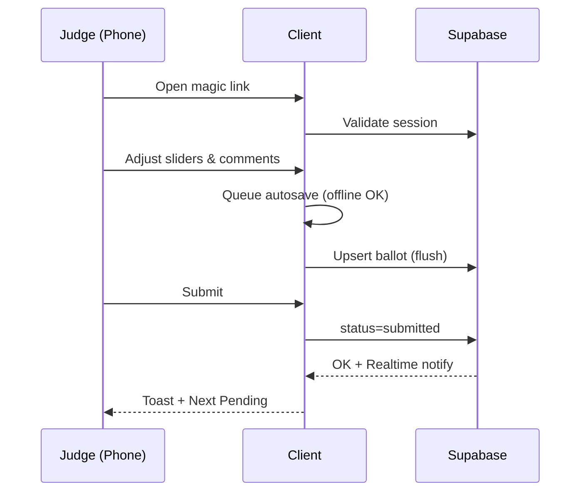
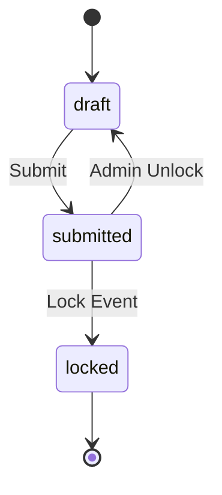
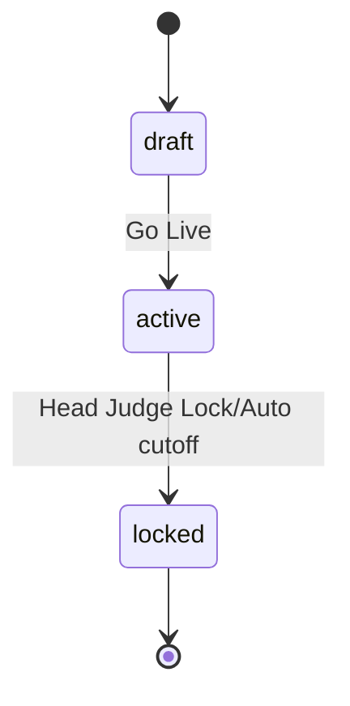

# Master PRD — AI‑IGNITION 2025 **Judging Brief + Finals Scoring App** (Mobile‑First)
_Vite + React + TypeScript + Supabase • Optimized for phones & tablets_  
_Version 2.0 — 24 Oct 2025 (SGT)_

> **Why mobile-first?** >85% of judges will use phones/tablets during finals. This PRD prioritizes single‑hand use, big tap targets, offline resilience, and low-latency realtime updates. It unifies the **Judging Brief Interactive Website** and the **Finals Scoring App** into one coherent mobile-first product.

---

## Table of Contents
1. [Scope & Objectives](#scope--objectives)  
2. [Users, Context & Devices](#users-context--devices)  
3. [Success Metrics & Budgets](#success-metrics--budgets)  
4. [Product Surface Map](#product-surface-map)  
5. [Mobile‑First Design System](#mobilefirst-design-system)  
6. [Feature Index & Priority](#feature-index--priority)  
7. [Feature Specs (Mobile‑First)](#feature-specs-mobilefirst)  
8. [User Flows (All Roles)](#user-flows-all-roles)  
9. [Data Model (Reference)](#data-model-reference)  
10. [APIs & Realtime](#apis--realtime)  
11. [Security, RLS & Audit](#security-rls--audit)  
12. [Performance & Offline Strategy](#performance--offline-strategy)  
13. [Accessibility](#accessibility)  
14. [QA Device Matrix & Test Plan](#qa-device-matrix--test-plan)  
15. [Deployment & ENV](#deployment--env)  
16. [Open Questions & Decisions](#open-questions--decisions)  
17. [Day‑of Runbook (Mobile)](#dayof-runbook-mobile)  
18. [Definition of Done](#definition-of-done)  
19. [Appendix](#appendix)

---

## Scope & Objectives
**Scope:**  
- A. **Judging Brief Interactive Website** (single page): rules, criteria, problem statements, judges, finalists (dynamic), **“Launch Scoring App”** deep link.  
- B. **Finals Scoring App**: judge scoring, autosave/offline, live ranks (gated), admin console (timers, normalization, tie‑break, lock, exports).

**Objectives:**  
- <10 minutes for a judge to understand flow via Brief site.  
- <90 seconds median to score a team on phone.  
- 100% uptime during finals; seamless offline capture with autosync.  
- Minimal auth friction (magic link primary, PIN on-site backup).

---

## Users, Context & Devices
- **Judges**: primarily **phones** (iPhone/Android), some tablets. On venue Wi‑Fi + 4G fallback. One-hand usage, quick sessions per team.  
- **Head Judge**: iPad/Tablet or laptop. Needs admin console controls visible without horizontal scroll.  
- **Organizer/Ops**: laptop (ops desk). Running timers, provisioning, unlocks, exports.  
- **Technical Admin**: laptop. Deploys, monitors Supabase, Edge Functions, logs.

**Target devices (minimums):**  
- iPhone 12/13/14/15 (iOS 16+), Pixel 6/7/8 (Android 12+), iPad 10.2"+ (iPadOS 16+), Chrome ≥ 118, Safari ≥ 16.

---

## Success Metrics & Budgets
- **TTFB** < 500ms (edge hosted), **LCP** < 2.2s (3G Fast emulation), **JS** < 250KB gzipped initial.  
- Tap target size **≥44px**, body text ≥16px, contrast **AA**.  
- **Submission reliability**: 0 data loss; autosave latency < 1.5s online.  
- **Realtime rank freshness**: updates ≤ 2s from submission.  
- **Crash‑free rate**: 100% during finals window.

---

## Product Surface Map
- **/brief** — Judging Brief (static + dynamic finalists).  
- **/score** — Judge scoring (phone‑first).  
- **/admin** — Head Judge & Ops console (tablet/laptop‑first, still responsive).  
- **/api/** — Edge Functions (PIN login, PDF export optional).  
- **Supabase** — DB, Auth, Realtime (ap‑southeast‑1).

Deep link from Brief → Score: `…/score?event=2025-finals&token=<magic>`

---

## Mobile‑First Design System
**Breakpoints (Tailwind):**  
- `base (≤640px)` **primary target** for judges.  
- `md (641–1024px)` tablets.  
- `lg (≥1025px)` laptops (admin/ops).

**Layout patterns:**  
- **Single column** on phones; cards stack; sticky bottom **Submit** bar.  
- **Bottom sheets** for modals; avoid fullscreen popovers.  
- **Sticky anchors** in Brief; smooth scroll; large accordions.  
- **Safe areas**: respect notches/home indicators (`env(safe-area-inset-*)`).

**Inputs & gestures:**  
- Sliders with step=1, haptic‑friendly.  
- One‑tap Submit, confirm via toast; no confirm dialogs unless destructive.  
- Pull‑to‑refresh allowed on /score and /admin.

**Branding:** Nexius palette (`#5B7CFA`, `#1C1F2A`, `#EEF2FF`, `#7AE1C3`), Inter/Poppins.

---

## Feature Index & Priority
| ID | Feature | Priority | Mobile Focus |
|---|---|---|---|
| F0 | Platform, Theme, PWA Shell | P0 | Phone‑first layout, installable app |
| F1 | Auth (Magic Link + PIN) | P0 | 2‑tap entry; numeric keypad for PIN |
| F2 | Brief (Mobile Nav + Anchors) | P0 | Cards, big CTAs, smooth scroll |
| F3 | Judge Scoring UI (Sliders 1–10) | P0 | Big sliders, sticky Submit, thumb‑reach |
| F4 | Autosave & Offline Queue | P0 | Local queue; banners; retry |
| F5 | Comments (Strength/Improvement) | P0 | Short inputs; mobile keyboards |
| F6 | Submit & Locking (+ Unlock Requests) | P0 | Idempotent submit; snackbars |
| F7 | Live Ranking (Raw) — Gated | P0 | Visible to judges only after all submit |
| F8 | Admin Console (Responsive) | P0 | Tablet first; works on phones |
| F9 | Central Timer Sync (7m/5m) | P1 | Large digits; lock orientation optional |
| F10 | Normalization & Drop Extremes | P1 | Toggle with explainer badge |
| F11 | Tie‑Break Vote | P1 | Single‑tap ballots |
| F12 | Exports (CSV/JSON/PDF) | P1 | Server‑side PDF preferred |
| F13 | Security, RLS & Audit | P0 | Least‑privilege; no PII in DOM |
| F14 | Observability & Analytics | P1 | Minimal, privacy‑safe |
| F15 | Data Seeding & Admin Tools | P0 | CSV helpers; quick bring‑up |
| F16 | Accessibility & Performance | P0 | AA contrast; <2s LCP |
| F17 | Deployment & ENV | P0 | Vercel/Netlify + SIM DNS |
| F18 | **PWA Installability** | P1 | Manifest + SW caching shell |
| F19 | **Orientation & Safe Areas** | P1 | Respect portrait/landscape; safe insets |
| F20 | **Connectivity UX & Error States** | P0 | Clear offline/slow banners & retries |

---

## Feature Specs (Mobile‑First)

### F0 — Platform, Theme, PWA Shell (P0)
- Vite React TS + Tailwind; theme tokens for colors/spacing.
- **PWA**: manifest + service worker (cache shell & static assets).
- > **Decision [owner=Codex Agent][date=2024-02-02]:** Maintain the authoritative theme token list directly in-repo (Tailwind + shared JSON) and mirror updates back to design tools as needed.
- > **Decision [owner=Codex Agent][date=2024-02-02]:** Precache a curated JSON snapshot of essential brief content (criteria overview, schedule, finalist list) alongside the application shell; fetch dynamic updates on demand.

**Mobile AC:** base viewport scales; safe‑area paddings; 44px targets; <250KB gz initial JS.

### F1 — Auth (Magic Link + PIN) (P0)
- Magic link (primary); **numeric keypad** for PIN on mobile; auto‑focus inputs.
- Session TTL end of finals day; local session persistence.

> **Decision [owner=Codex Agent][date=2024-02-05]:** Allow magic-link requests from any domain, with Supabase sign-in restricted to pre-registered judge accounts per event roster.
> **Decision [owner=Codex Agent][date=2024-02-05]:** Provision judge PINs as organizer-assigned, single-use codes with nightly rotation control handled by ops tooling.
> **Decision [owner=Codex Agent][date=2024-02-05]:** Handle lost-device recovery through the organizer console, which invalidates the prior session and issues a fresh magic link or PIN on demand.

**Mobile AC:** 2‑tap login; large email/PIN inputs; explicit failure toasts.

### F2 — Brief (Mobile Nav + Anchors) (P0)
- Single page: Hero → Overview → Flow → Criteria (expanders) → Scoring CTA → Problems → Judges → Finalists → Contact.
- Large accordions; anchor chips dock at top on scroll.
> **Decision [owner=Codex Agent][date=2024-02-06]:** Store hero, overview, flow, and CTA copy in Supabase `brief_content` tables, enabling remote edits with offline prefetch mirroring in the PWA shell.
> **Decision [owner=Codex Agent][date=2024-02-06]:** Serve judges and finalists from Supabase views with background refetch + manual refresh, persisting last-known payloads for offline use instead of realtime channels.
> **Decision [owner=Codex Agent][date=2024-02-06]:** Cache last-known brief data (content + rosters) client-side with freshness timestamps and display an offline banner when falling back to stored payloads.

**Mobile AC:** no horizontal scroll; images responsive; tap targets ≥44px.

### F3 — Judge Scoring UI (P0)
- 4 sliders (1–10) with “what good looks like”; **sticky Submit bar**; weighted total preview.
- Keyboard‑accessible; left/right swipe not required.
> **Decision [owner=Codex Agent][date=2024-02-07]:** Source slider labels and helper text directly from the judging brief Supabase content to maintain a single, easily updatable content surface.
> **Decision [owner=Codex Agent][date=2024-02-07]:** Display the weighted total using the official per-criterion weights supplied by ScoringOps so the preview matches backend calculations exactly.
> **Decision [owner=Codex Agent][date=2024-02-07]:** Require judges to make an explicit first interaction before a slider locks in a value, preventing accidental default scores while preserving fast adjustments thereafter.

**Mobile AC:** one‑hand use; no accidental scroll traps; Submit visible w/o extra scroll.

### F4 — Autosave & Offline Queue (P0)
- Debounce 300ms → local queue (localStorage) → flush on reconnect; offline/online banners.
- Duplicate suppression via upsert (judge_id+team_id).

> **Decision [owner=Product][date=2024-02-09]:** Cap the offline autosave queue at 50 ballots per judge/event, pruning the oldest entry once the cap is exceeded, and require session-scoped AES-GCM encryption so cached payloads stay obfuscated on shared devices until they sync.

> **Decision [owner=Engineering][date=2024-02-09]:** Standardize autosave retries on exponential backoff starting at 2s with jitter, doubling up to a 60s ceiling while the app remains open, and expose a manual retry trigger when the ceiling is reached.

**Mobile AC:** airplane mode test passes; banner doesn’t block UI.

### F5 — Comments (P0)
- Two optional fields; mobile keyboards with sentence case; 140‑char guide.

**Mobile AC:** inputs don’t jump when keyboard opens; page scroll locked to input context.

### F6 — Submit & Locking (+ Unlock Requests) (P0)
- Idempotent `submit`; read‑only after submit; “Request Unlock” bottom sheet.
- Admin unlock writes to audit.

**Mobile AC:** Submit feedback toast; disabled state + spinner; no double taps.

### F7 — Live Ranking (Gated) (P0)
- `rankings_view` → raw averages; **hidden from judges** until all submit.
- Admin always sees ranks.

**Mobile AC:** table collapses to cards on phones; font‑mono values.

### F8 — Admin Console (Responsive) (P0)
- Grid: Judge×Team completion, toggles, timers, exports.
- Tablet first; on phones, collapse grid to lists w/ sticky tool row.

**Mobile AC:** Primary controls reachable with thumb; no horizontal scroll.

### F9 — Central Timer Sync (P1)
- Admin controls Start 7:00 / 5:00; pause/resume/reset; push epoch for drift correction.
- Optional **orientation lock** for timer view (landscape).

**Mobile AC:** Timer digits ≥ 40px; high contrast; haptic tick optional.

### F10 — Normalization & Drop Extremes (P1)
- Toggles with explanation tooltips; banner “Normalization Active” if on.
- Drop hi/lo only if ≥5 judges.

**Mobile AC:** Toggle switches large; info sheets usable in bottom sheet.

### F11 — Tie‑Break Vote (P1)
- One‑tap ballot; deterministic tiebreak (Tech > Impact > Innovation > Presentation > Vote).

**Mobile AC:** buttons well‑spaced; confirmation toast.

### F12 — Exports (P1)
- CSV/JSON/PDF; method (raw/normalized) annotated; checksum parity with UI.
- PDF server‑side (Edge Function) for formatting consistency.

### F13 — Security, RLS & Audit (P0)
- RLS: judges can only read/write own ballots for event; admin elevated.  
- No emails or tokens in client‑rendered DOM.

### F14 — Observability & Analytics (P1)
- Minimal event counters; submit latency; offline queue size (anonymized).

### F15 — Data Seeding & Admin Tools (P0)
- SQL migrations + seed CSVs; admin CSV uploader (optional).

### F16 — Accessibility & Performance (P0)
- WCAG AA; slider labels & ARIA; focus rings visible; reduced motion preference respected.
- Performance: code split admin route; prefetch next team data; image lazy‑load.

### F17 — Deployment & ENV (P0)
- Vercel or Netlify; SIM subdomain CNAME. Supabase region ap‑southeast‑1.

### F18 — PWA Installability (P1)
- Manifest icons; name/short_name; `display: standalone`; `start_url: /score`.
- iOS splash screens (auto via meta); add to Home Screen guidance.

### F19 — Orientation & Safe Areas (P1)
- Default portrait; timer page supports landscape; apply `padding: env(safe-area-inset-*)`.

### F20 — Connectivity UX & Error States (P0)
- Banners: Offline, Reconnecting, Slow network.  
- Retries with backoff; single place to view pending queue count.

---

## User Flows (All Roles)

### Judge (Phone) — Primary Path
1) Open **magic link** → **/score** lobby for `2025-finals`.  
2) See **team list** (Pending/Submitted) + timer badge.  
3) Tap first Pending → **score screen**.  
4) Move sliders 1–10; add optional comments.  
5) **Autosave** silently; offline shows banner & keeps queue.  
6) Tap **Submit** → lock ballot; toast “Submitted”.  
7) Auto‑advance next Pending until done.  
8) If correction needed: **Request Unlock** → wait for approval.

**Sequence**


### Head Judge (Tablet) — Control Path
1) Open **/admin** → verify judge progress grid.  
2) Start **7:00 pitch** timer; visible to all.  
3) Monitor **live ranking** (raw).  
4) If variance high → toggle **Normalization** or **Drop Extremes**.  
5) Run **Tie‑Break Vote** if required.  
6) Once all in → **Lock Event**; **Export** artifacts.

### Organizer/Ops (Laptop) — Support Path
- Pre‑event: seed criteria/teams/judges, send links, print PINs, smoke test.  
- Event: help with logins/PINs, process **unlock requests** as approved, keep timers in sync.  
- Post‑event: verify **exports**, archive to ceremony folder; schedule 90‑day purge for ballots.

### Technical Admin (Laptop) — Setup/Monitoring
- Apply SQL migrations, RLS, Realtime.  
- Configure Edge Functions (PIN login, PDF).  
- Watch logs & performance; keep backups and checksum parity.

**State Machines**

_Ballot_


_Event_


---

## Data Model (Reference)
- `events(id, name, date, status[draft|active|locked], scoring_method jsonb, created_at)`  
- `judges(id, name, organization, role, pin_hash, is_head, is_active, created_at)`  
- `teams(id, code, name, problem_statement, description, solution_link, deck_link, video_link, event_id, order_index)`  
- `criteria(id, key[innovation|technical|impact|presentation], name, weight, max_points, description)`  
- `ballots(id, event_id, team_id, judge_id, scores jsonb, comments jsonb, total_raw numeric, status[draft|submitted|locked], submitted_at, updated_at)`  
- `audit_logs(id, actor_type, actor_id, event_id, action, meta jsonb, created_at)`  
- `rankings_view(event_id, team_id, team_name, avg_total_raw, stddev_total, n_judges, rank_raw)`

---

## APIs & Realtime
- `GET /events/:eventId/teams` • `GET /criteria` • `GET /ballots/me?eventId=...`  
- `POST /ballots` (upsert; autosave queue) • `POST /ballots/:id/submit` (idempotent)  
- `POST /admin/events/:eventId/lock` • `POST /admin/events/:eventId/settings` (normalize/drop)  
- `POST /admin/tiebreak` • `GET /rankings?eventId=...`  
- **Realtime**: Postgres changes on `ballots` (invalidate ranks, progress); timer channel.

---

## Security, RLS & Audit
- RLS: judge can read/write only their own ballots for active event.  
- Admin: can read all, toggle settings, lock, export, unlock.  
- Magic links sent privately; PINs distributed on-site; no emails/tokens in DOM.  
- Audit every scoring change, submit, unlock, lock, normalization toggle.

---

## Performance & Offline Strategy
- **Budgets**: JS < 250KB gz initial; LCP < 2.2s; TTI < 2.5s on 3G Fast.  
- **Code‑split** admin route; lazy load charts only on admin.  
- **Prefetch** next team data after submit.  
- **PWA SW**: cache shell & static assets; **do not cache** private API responses.  
- **Offline queue**: localStorage (MVP) with retries & backoff.  
- **Images** responsive, lazy‑loaded; `fetchpriority=high` for hero text only.

---

## Accessibility
- WCAG **AA**: contrast, focus rings, label+aria for sliders, screen‑reader hints for weights.  
- Reduced motion: respect `prefers-reduced-motion`; disable non‑essential transitions.  
- Keyboard nav works on desktop; on mobile, ensure proper focus on inputs.

---

## QA Device Matrix & Test Plan
**Devices**: iPhone 13/14/15, Pixel 6/7/8, iPad 10.2"/Air, Macbook Chrome/Safari.  
**Scenarios**:  
- Magic link login, PIN login, offline autosave, reconnect flush, submit idempotency, unlock flow, timer sync, normalization toggle, tie‑break ballot, export parity (CSV vs UI checksum), landscape timer.

---

## Deployment & ENV
**Frontend**: Vercel (preferred) or Netlify; SIM subdomain CNAME to prod.  
**Backend**: Supabase (ap‑southeast‑1).

**ENV**
```
VITE_SUPABASE_URL=
VITE_SUPABASE_ANON_KEY=
VITE_EVENT_ID=EVENT_2025_FINALS_UUID
VITE_APP_NAME="AI-IGNITION Scoring"
```
(Edge Functions secrets managed in Supabase.)

---

## Open Questions & Decisions
1) **PWA install prompt**  
   - Choices: Prompt on /score load / Passive “Add to Home Screen” tip / Disable for finals  
   - **Recommendation**: Passive tip; avoid distracting judges.

2) **Orientation handling**  
   - Choices: Force portrait for /score / Allow both / Landscape for timer only  
   - **Recommendation**: Portrait for /score, both for /admin, optional landscape for timer.

3) **Ranking visibility to judges**  
   - Choices: Always / After own submit / **After all judges submit**  
   - **Recommendation**: After all submit to avoid anchoring.

4) **Normalization default**  
   - Choices: **None** / Min‑Max / Z‑score  
   - **Recommendation**: None; enable Min‑Max only if std‑dev of totals > 1.5.

5) **Drop extremes (≥5 judges)**  
   - Choices: Off / On  
   - **Recommendation**: Off by default; Head Judge toggle with banner + export note.

6) **Offline queue store**  
   - Choices: localStorage (MVP) / IndexedDB  
   - **Recommendation**: localStorage now; move to IndexedDB post‑event.

7) **PDF export rendering**  
   - Choices: Client (html2pdf) / **Server** (Edge Function)  
   - **Recommendation**: Server for consistent pagination.

8) **Data retention**  
   - Choices: Keep raw indefinitely / **Purge raw after 90 days; retain exports + audit**.

---

## Day‑of Runbook (Mobile)
- **T‑60m**: Smoke test magic links, PINs, timer sync; verify ranks & export parity.  
- **T‑10m**: Judges open /score; Ops ready with PINs & QR to help.  
- **During**: Watch progress grid; approve unlocks; avoid toggling normalization unless needed.  
- **After**: Lock event; export CSV/JSON/PDF; announce; archive to ceremony folder; set purge job (90 days).

---

## Definition of Done
- All **P0** features shipped and verified on phones (portrait).  
- **No data loss** in offline/online tests; autosave/submit idempotent.  
- **Realtime** refresh ≤2s; **LCP** ≤ 2.2s on 3G Fast.  
- Accessibility **AA**; tap targets ≥44px; keyboard support on desktop.  
- Admin can lock, export, and operate timers comfortably on tablet.

---

## Appendix

### A) PWA Manifest (example)
```json
{
  "name": "AI-IGNITION Scoring",
  "short_name": "AI-IGNITION",
  "start_url": "/score",
  "display": "standalone",
  "background_color": "#FFFFFF",
  "theme_color": "#5B7CFA",
  "icons": [
    { "src": "/icons/icon-192.png", "sizes": "192x192", "type": "image/png" },
    { "src": "/icons/icon-512.png", "sizes": "512x512", "type": "image/png" }
  ]
}
```

### B) Service Worker Caching (shell-only sketch)
```js
self.addEventListener('install', (e) => {
  e.waitUntil(caches.open('ai-ignition-shell-v1').then(c => c.addAll([
    '/', '/score', '/manifest.webmanifest',
    '/assets/index.css', '/assets/index.js'
  ])))
})
self.addEventListener('fetch', (e) => {
  const url = new URL(e.request.url)
  // Bypass Supabase and private API calls
  if (url.hostname.includes('supabase.co') || url.pathname.startsWith('/api/')) return
  e.respondWith(caches.match(e.request).then(r => r || fetch(e.request)))
})
```

### C) SQL Sketch (seed + rankings view)
```sql
insert into criteria (id, key, name, weight, max_points) values
  (gen_random_uuid(),'innovation','Innovation & Originality',0.25,10),
  (gen_random_uuid(),'technical','Technical Execution & Usability',0.30,10),
  (gen_random_uuid(),'impact','Impact & Value',0.25,10),
  (gen_random_uuid(),'presentation','Presentation & Clarity',0.20,10);

create or replace function compute_total(scores jsonb)
returns numeric language sql as $$
  with w as (select key, weight from criteria
             where key in ('innovation','technical','impact','presentation'))
  select round(sum( ( (scores->>key)::int * weight ) ), 4) from w;
$$;

create or replace function ballots_bu_total()
returns trigger language plpgsql as $$
begin
  new.total_raw := compute_total(new.scores);
  return new;
end $$;

create trigger ballots_bu before insert or update of scores on ballots
for each row execute function ballots_bu_total();

create or replace view rankings_view as
select
  b.event_id,
  t.id as team_id,
  t.name as team_name,
  avg(b.total_raw)::numeric(6,3) as avg_total_raw,
  stddev_pop(b.total_raw)::numeric(6,3) as stddev_total,
  count(*) as n_judges,
  dense_rank() over (partition by b.event_id order by avg(b.total_raw) desc) as rank_raw
from ballots b
join teams t on t.id = b.team_id
where b.status = 'submitted'
group by b.event_id, t.id, t.name;
```
